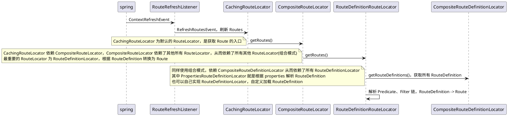
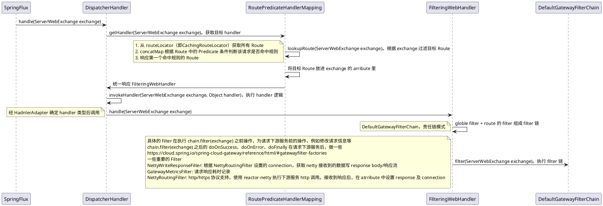

# 疑问
## 自定义扩展
  - 协议转换
    - 实现 GlobalFilter [GlobalFilter](https://cloud.spring.io/spring-cloud-gateway/reference/html/#writing-custom-global-filters)
    - http -> dubbo
  - filter
    > 实现 AbstractGatewayFilterFactory [AbstractGatewayFilterFactory](https://cloud.spring.io/spring-cloud-gateway/reference/html/#writing-custom-gatewayfilter-factories)
    - 限流降级熔断，是否直接支持 sentinel
     > sentinel 官方适配包 [sentinel-adaptor](https://sentinelguard.io/zh-cn/docs/api-gateway-flow-control.html)
  - predicate
    > 实现 AbstractRoutePredicateFactory [AbstractRoutePredicateFactory](https://cloud.spring.io/spring-cloud-gateway/reference/html/#writing-custom-route-predicate-factories)
  - route 配置加载
    > 实现 RouteDefinitionLocator [RouteDefinitionLocator](https://cloud.spring.io/spring-cloud-gateway/reference/html/#configuration)
## 监控数据
  - 默认 metrics 怎么样的 
    > 自带的 metric filter [metrics filter](https://cloud.spring.io/spring-cloud-gateway/reference/html/#the-gateway-metrics-filter)
  - 如何自定义格式，自定义 collect
  
## 源码
### 概念
https://cloud.spring.io/spring-cloud-gateway/reference/html/#glossary
- Route. gateway 中最基本的概念。由 id、url(下游目标 Url)、一些 Predicate、一些 Filter 组成，可以理解成 gateway 接受到请求后可能执行的一个路径，gateway 中有很多 Route，请求过来根据 Route 中的 Predicate 判断该请求是否命中 Route 规则，然后再执行 Filter 链
- Predicate. 概含义念同 java 的 Predicate，gateway 用来判断一个请求是否匹配，实现为 AsyncPredicate 稍微包装了一下，入参是包含请求信息的 ServerWebExchange，响应为 Boolean
- Filter. GatewayFilter 在调用下游服务之前、之后可以修改请求、响应信息

### 流程
#### 启动时加载 Route 

#### 调用流程

